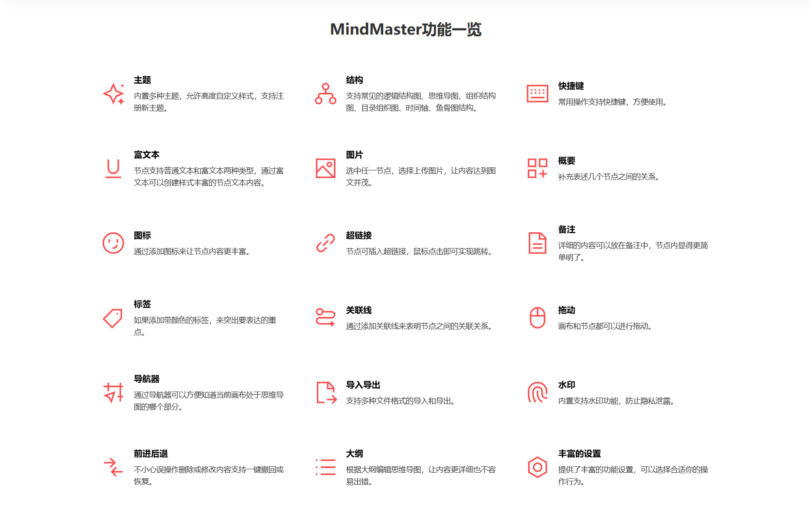

<p align="center">
  
</p>

<h1 align="center">MindMaster | 思维导图大师</h1>

一个基于 Vue3 + FastAPI 的现代化在线思维导图应用，支持实时保存（全部在浏览器本地更安全）、导出多种格式和节点级的操作等，图谱支持逻辑结构图（向左、向右逻辑结构图）、思维导图、组织结构图、目录组织图、时间轴（横向、竖向）、鱼骨图等结构。

GITHUB 同步更新：<https://github.com/phoenixor/MindMaster>

🌟另外基于本项目正在开发 AI 版，欢迎加下面QQ群交流。

# ⚠️ 开源声明

请严格遵循 [MIT](./LICENSE) 开源协议

# 🛠️ 技术栈

- **框架**：Vue 3.5+（Composition API）
- **构建工具**：Vite 7
- **状态管理**：Pinia
- **路由**：Vue-Router 4
- **事件总线**：eventemitter3（为什么不用mitt后面有说明）
- **UI 组件库**：[TDesign Web Vue Next](https://tdesign.tencent.com/vue-next/components/overview)
- **思维导图核心库**：[wanglin2/mind-map](https://github.com/wanglin2/mind-map)
- **后端框架**：Python 3.11+，FastAPI

# 😄 界面预览

<table>
  <tr>
    <td></td>
    <td></td>
  </tr>
  <tr>
    <td></td>
    <td></td>
  </tr>
</table>

# 💓 支持开发者

如果这个项目对你有帮助，欢迎扫码打赏一杯咖啡☕️，你的支持是我持续维护的动力～

## 微信赞赏


# 📦 快速开始

本项目采用前后端分离开发模式，但是部署时为了简化，直接将前端打包的静态文件挂载在 FastAPI 的根路由上，你也可以自己写 nginx ，或者打包成 Docker。

所以开发到部署的基本逻辑是：前端打包到dist目录 ---> 运行fastapi的uvicorn服务。

## 1. 克隆项目

```bash
git clone https://gitee.com/phoenixor/mind-master.git
```

## 2. 安装依赖

1️⃣ 前端

```bash
cd mind-master/frontend
npm install
pnpm run build
```

2️⃣ 后端

```bash
cd mind-master
python -m venv venv
source venv/bin/activate
pip install -r requirements.txt
```

## 3. 启动项目

```bash
python main.py
```

项目首页：<http://localhost:8000>

前端演示地址（国内访问可能很慢）：<https://mindmaster-b3y.pages.dev/>

# 🐧技术交流QQ群


# ❓ 一些问题的说明

## Q：为什么没使用Typescript？

A：首先是核心思维导图库 [wanglin2/mind-map](https://github.com/wanglin2/mind-map) 天生不支持ts，其次我觉得ts写起来很麻烦，小项目业务代码没必要用强类型。

## Q：为什么事件总线不使用 Vue3 主流的 mitt？

A：一开始确实使用了 mitt，但在开发过程中发现当事件回调参数超过两个时，只能接收到第一个参数。经过研究发现，mitt 的实现机制与 eventemitter3 不同， mitt 触发事件时需要将多个参数包装成一个对象传递，且只能接收一个回调参数。

为了解决这个问题并保持与 [wanglin2/mind-map](https://github.com/wanglin2/mind-map) 一致的使用体验，最终选择使用 eventemitter3 替代 mitt。

# 💗 致谢

我在写这个项目时本着学习的态度，借鉴了以下开源库，感谢作者的辛勤付出：

 [wanglin2/mind-map](https://github.com/wanglin2/mind-map)

我完全重构了项目，使用 vue3 最新技术栈，重新组织了工程化结构，代码中大量使用了组件化、模块化思想，并标注了完整的 JSDOC 注释以弥补没用 ts 的类型提示缺陷。相比原项目，代码结构和逻辑更清晰，上手学习或者二开应该都很容易。
